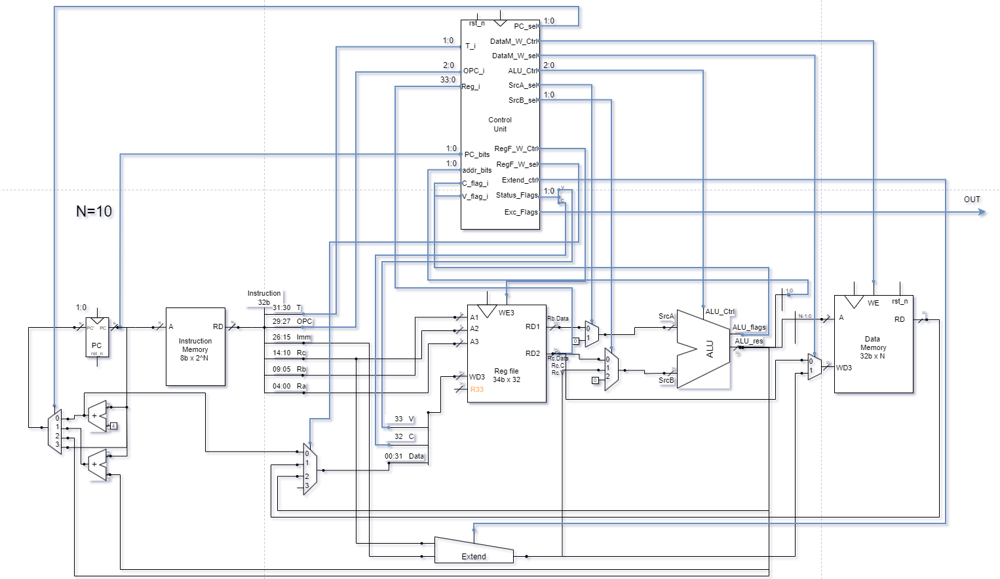

### `RISC_One_Cycle` - Especificaciones del Diseño 

#### Resumen
`RISC_One_Cycle` contiene la implementacion de un procesador RISC One Cycle que cumple con las especificaciones proporcionadas por la guía `RTL Exercise Training` de Allegro.

#### Diagrama



#### Módulos
- **top_module.sv**: Módulo principal. En este módulo se instancian y conectan el resto de los módulos.
- **control_unit_mod.sv**: Unidad de control. Este módulo genera las señales de control necesarias para el funcionamiento del procesador, decodificando las instrucciones y activando las señales y excepciones correspondientes.
- **data_memory_mod.sv**: Memoria de datos.
- **register_file_mod.sv**: Memoria de registros. Contiene los 32 registros del procesador.
- **instruction_memory_mod.sv**: Memoria de instrucciones. Almacena el conjunto de instrucciones que serán ejecutadas por el procesador.
- **program_counter_mod.sv**: Contador de programa. Registro de la dirección de la siguiente instrucción a ejecutar.
- **extender_mod.sv**: Extensor de señal. Extiende a 32 bits el parametro Immediate o su concatenacion con el parametro Rc.
- **alu_mod.sv**: Unidad Aritmético-Lógica. Realiza operaciones aritméticas y lógicas sobre los datos proporcionados por los registros o la memoria.


#### Entradas
- **clk**: Señal de reloj.
- **rst_n**: Señal de reinicio activa en bajo. Cuando está en bajo (`0`) resetea el módulo al estado "A".

#### Salidas
- **exception_flags_o**: Señales de bandera de excepción de 3 bits: Instrucción inválida, dirección de memoria inválida y dirección de program counter inválida.
- **alu_result_o**: Resultado de 32 bits de la operación realizada por la ALU.
- **reg_file_r_data1_o**: Datos de 34 bits leídos del primer registro de la memoria de registros.
- **reg_file_r_data2_o**: Datos de 34 bits leídos del segundo registro de la memoria de registros.
- **data_mem_r_data_o**: Datos de 32 bits leídos de la memoria de datos.
- **pc_o**: Contador de programa de `N` bits. 
- **inst_read_data_o**: Datos de 32 bits leídos de la memoria de instrucciones.
- **alu_C_flag_o**: Señal de bandera de carry de la ALU. Indica si hubo un acarreo en la última operación aritmética.
- **alu_V_flag_o**: Señal de bandera de overflow de la ALU. Indica si hubo un desbordamiento en la última operación aritmética.

#### Estructura del proyecto
El proyecto se encuentra dividido en 5 carpetas:
- Modules: Aqui se encuentran los módulos que conforman procesador.
- testbenchs: Contiene los testbenchs correspondientes cada uno de los módulos.
- Assembler: Aqui puede encontrarse el compilador de assembler desarrollado en python, junto con el programa utilizado y un txt con su explicación.
- Memory files: Contiene los datos a precargar en las memorias para el target testbench.
- Documentación: Aqui se almacenan todos los archivos relevantes para la documentación.
```
📦RISC_One_Cycle
 ┣ 📂testbenchs
 ┃ ┣ 📜alu_tb.sv
 ┃ ┣ 📜top_module_target_tb.sv
 ┃ ┣ 📜control_unit_tb.sv
 ┃ ┣ 📜data_memory_tb.sv
 ┃ ┣ 📜instruction_memory_tb.sv
 ┃ ┣ 📜program_counter_tb.sv
 ┃ ┣ 📜register_file_tb.sv
 ┃ ┣ 📜extender_tb.sv
 ┃ ┗ 📜top_module_predictor_tb.sv
 ┣ 📂Assembler
 ┃ ┣ 📜RISC_compiler.py
 ┃ ┣ 📜output.bin
 ┃ ┣ 📜program1.asm
 ┃ ┗ 📜program1_explained.txt
 ┣ 📂Memory files
 ┃ ┣ 📜data_memory.hex
 ┃ ┗ 📜reg_memory.bin
 ┣ 📂Modules
 ┃ ┣ 📜alu_mod.sv
 ┃ ┣ 📜control_unit_mod.sv
 ┃ ┣ 📜register_file_mod.sv
 ┃ ┣ 📜data_memory_mod.sv
 ┃ ┣ 📜extender_mod.sv
 ┃ ┣ 📜instruction_memory_mod.sv
 ┃ ┣ 📜program_counter_mod.sv
 ┃ ┗ 📜top_module.sv
 ┗ 📂Documentation
 ┃ ┣ 📜One_cycle_diagram.png
 ┃ ┗ 📜RISC_One_Cycle_Specs_Hipperdinger.pdf
```

#### Simulación online

https://www.edaplayground.com/x/7vE8