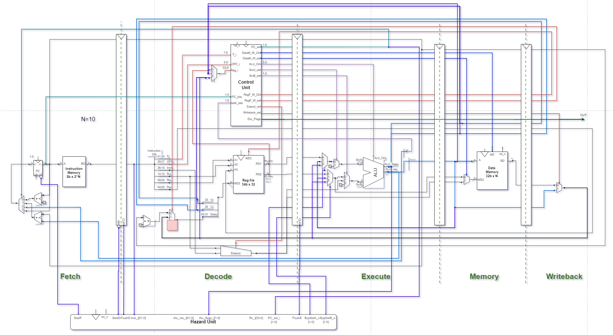
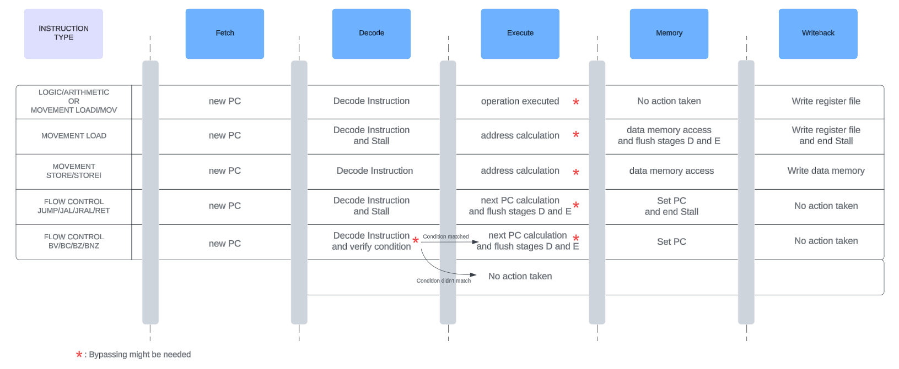

### `RISC_Pipeline` - Especificaciones del Diseño 

#### Resumen
`RISC_Pipeline` contiene la implementacion de un procesador RISC Pipeline que cumple con las especificaciones proporcionadas por la guía `RTL Exercise Training` de Allegro.

#### Diagrama



#### Modulos
- **top_module.sv**: Módulo principal. En este módulo se instancian y conectan el resto de los módulos.
- **control_unit_mod.sv**: Unidad de control. Este módulo genera las señales de control necesarias para el funcionamiento del procesador, decodificando las instrucciones y activando las señales y excepciones correspondientes.
- **data_memory_mod.sv**: Memoria de datos.
- **register_file_mod.sv**: Memoria de registros. Contiene los 32 registros del procesador.
- **instruction_memory_mod.sv**: Memoria de instrucciones. Almacena el conjunto de instrucciones que serán ejecutadas por el procesador.
- **program_counter_mod.sv**: Contador de programa. Registro de la dirección de la siguiente instrucción a ejecutar.
- **extender_mod.sv**: Extensor de señal. Extiende a 32 bits el parametro Immediate o su concatenacion con el parametro Rc.
- **alu_mod.sv**: Unidad Aritmético-Lógica. Realiza operaciones aritméticas y lógicas sobre los datos proporcionados por los registros o la memoria.
- **hazard_unit_mod.sv**: Unidad de control de Hazards. Genera las señales de control necesarias para el funcionamiento del procesador ante la aparición de Hazards.


#### Entradas
- **clk**: Señal de reloj.
- **rst_n**: Señal de reinicio activa en bajo. Cuando está en bajo (`0`) resetea el módulo al estado "A".

#### Salidas
- **exception_flags_o**: Señales de bandera de excepción de 3 bits: Instrucción inválida, dirección de memoria inválida y dirección de program counter inválida.
- **alu_result_o**: Resultado de 32 bits de la operación realizada por la ALU.
- **reg_file_r_data1_o**: Datos de 34 bits leídos del primer registro de la memoria de registros.
- **reg_file_r_data2_o**: Datos de 34 bits leídos del segundo registro de la memoria de registros.
- **data_mem_r_data_o**: Datos de 32 bits leídos de la memoria de datos.
- **pc_o**: Contador de programa de `N` bits. 
- **inst_read_data_o**: Datos de 32 bits leídos de la memoria de instrucciones.
- **alu_C_flag_o**: Señal de bandera de carry de la ALU. Indica si hubo un acarreo en la última operación aritmética.
- **alu_V_flag_o**: Señal de bandera de overflow de la ALU. Indica si hubo un desbordamiento en la última operación aritmética.


#### Comportamiento ante Hazards
- **T=1x or [T=00 and (OPC=x00 or  OPC=01x)]**: Al llegar a la etapa execute, se verifica en un registro interno de la hazard unit si recientemente se ha solicitado escribir alguno de los registros solicitados. De haberlos usado, se realiza bypassing desde la etapa de memory o writeback hacia la etapa de excecute. 
- **T=00 and OPC=000**: En la etapa decode se realiza un Stall con 3 clocks de duración. En el segundo y tercer clock se realizan flushes para introducir instrucciones NOP (Bubbles).
- **T=01 and (OPC= 000 or 101 or 110 or 111)**: En la etapa decode se realiza un Stall con 2 clocks de duración. En el segundo clock se realiza un flush para introducir una instruccion NOP (Bubbles).
- **T=01 and (OPC= 001 or 010 or 011 or 100)**: En la etapa decode se verifica si la condicion de la instruccion se cumple, aquí tambien puede ocurrir bypassing. Si no cumple, continua la ejecucion normal del programa. Si cumple, al segundo clock se realizan flushes en decode y execute y continua la ejecucion del programa.




#### Estructura del proyecto
El proyecto se encuentra dividido en 5 carpetas:
- Modules: Aqui se encuentran los módulos que conforman procesador.
- testbenchs: Contiene los testbenchs correspondientes cada uno de los módulos.
- Assembler: Aqui puede encontrarse el compilador de assembler desarrollado en python, junto con el programa utilizado y un txt con su explicación.
- Memory files: Contiene los datos a precargar en las memorias para el target testbench.
- Documentación: Aqui se almacenan todos los archivos relevantes para la documentación.
```
📦RISC_Pipeline
 ┣ 📂testbenchs
 ┃ ┣ 📜alu_tb.sv
 ┃ ┣ 📜top_module_target_tb.sv
 ┃ ┣ 📜control_unit_tb.sv
 ┃ ┣ 📜data_memory_tb.sv
 ┃ ┣ 📜instruction_memory_tb.sv
 ┃ ┣ 📜program_counter_tb.sv
 ┃ ┣ 📜register_file_tb.sv
 ┃ ┣ 📜extender_tb.sv
 ┃ ┣ 📜top_module_predictor_tb.sv
 ┃ ┗ 📜hazard_unit_tb.sv
 ┣ 📂Assembler
 ┃ ┣ 📜RISC_compiler.py
 ┃ ┣ 📜output.bin
 ┃ ┣ 📜program1.asm
 ┃ ┗ 📜program1_explained.txt
 ┣ 📂Memory files
 ┃ ┣ 📜data_memory.hex
 ┃ ┗ 📜reg_memory.bin
 ┣ 📂Modules
 ┃ ┣ 📜alu_mod.sv
 ┃ ┣ 📜control_unit_mod.sv
 ┃ ┣ 📜register_file_mod.sv
 ┃ ┣ 📜data_memory_mod.sv
 ┃ ┣ 📜extender_mod.sv
 ┃ ┣ 📜instruction_memory_mod.sv
 ┃ ┣ 📜program_counter_mod.sv
 ┃ ┣ 📜top_module.sv
 ┃ ┗ 📜hazard_unit_mod.sv
 ┗ 📂Documentation
 ┃ ┣ 📜RISC_PIPELINE_Specs_Hipperdinger.pdf
 ┃ ┗ 📜Pipeline_diagram.png
 ┃ ┗ 📜hazard_handling.png
 ┃ ┗ 📜hazard_handling2.png
```

#### Simulación online

https://www.edaplayground.com/x/Spyt